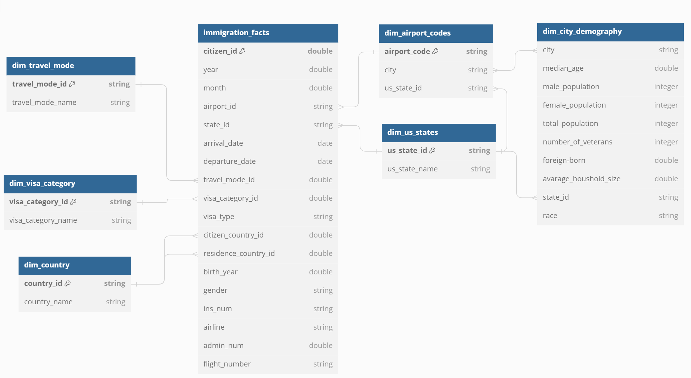
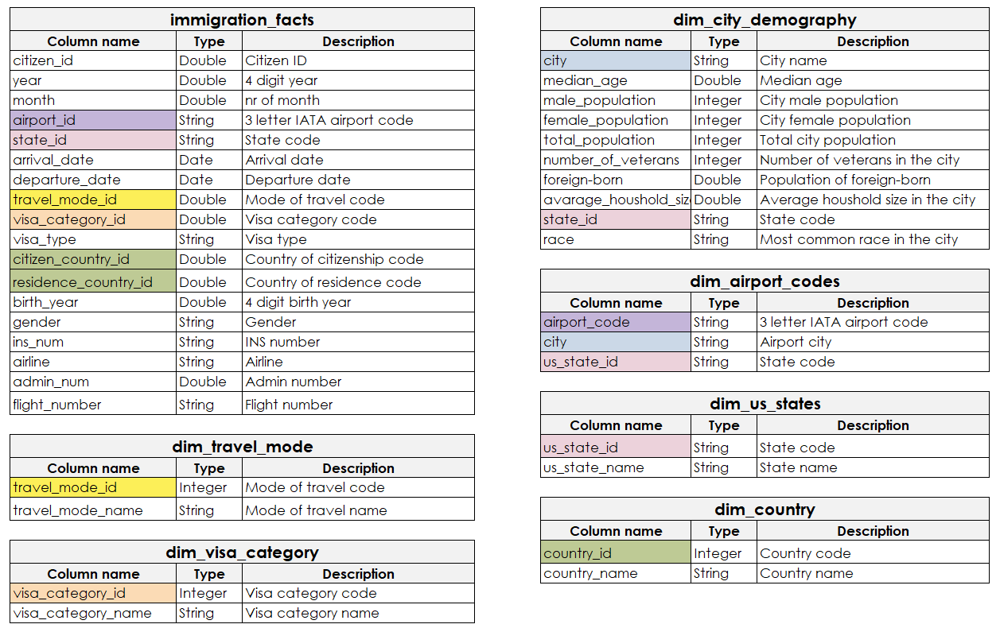

# Immigration airport datalake
### Data Engineering Capstone Project

#### Project Summary
This project will build a data lake combining immigration and demographic data in the US.

The project follows the follow steps:
* Step 1: Scope the Project and Gather Data
* Step 2: Explore and Assess the Data
* Step 3: Define the Data Model
* Step 4: Run ETL to Model the Data
* Step 5: Complete Project Write Up

### 1 Scoping the Project and Gathering Data

#### Scope 
The goal of this project is to prepare an immigration S3 datalake to be used with olap queries and BI apps. The final data should allow users to analize immigraton numbers with the added context of US cities demographic data. 

A couple example queries include:
1. Which city had the most visits last month?
2. Which city had the highest share of immigrant visits compared to total city population?
3. What are the top 3 nationalities of immigrants comming to New York last year?

#### Data description
The project will use I94 immigration and US cities demographic data.

### 2 Data model definition
#### 2.1 Conceptual Data Model
For the purpose of this project we will model a star schema, since it's easily understandable and can be imported to a BI app such as Power BI.

#### 2.2 Data pipeline steps
1. Load and clean immigration dataset
2. Load us city demography dataset
3. Load and transform data labels
4. Perform 2 data quality checks
5. Load data to S3

### 3 Running pipelines to model the data
#### 3.1 Creating the data model
Data was processed and modeled using PySpark.
#### 3.2 Data quality checks
After processing the data 2 checks were made.
1. Checking if the keys in dimensions tables are unique.
2. Checking if any of the tables are empty.
#### 3.3 Data dictionary

#### 3.4 Results and example queries
After running the pipeline we receive tables containing number of rows as shown below:
| table_name          | count   |
|---------------------|---------|
| immigration_facts   | 3096313 |
| dim_city_demography | 596     |
| dim_travel_mode     | 4       |
| dim_country         | 289     |
| dim_visa_category   | 3       |
| dim_us_states       | 54      |
| dim_airport_codes   | 660     |

Users can now run queries as presented in the scope of this project:
1. Which city had the most visits last month?
Query:
```
SELECT
    air.city,
    imf.airport_code,
    imf.immigrant_visits
FROM
    (SELECT 
        im.airport_code AS airport_code, 
        COUNT(*) AS immigrant_visits
    FROM immigration_facts im
    WHERE im.month = 4
    GROUP BY im.airport_code
    LIMIT 10
    ) as imf
JOIN dim_airport_codes as air
    ON air.airport_code = imf.airport_code
    ORDER BY imf.immigrant_visits DESC
```
Result:
|            city        | airport_code | immigrant_visits |
|----------------------- | ------------ | ---------------- |
|        NEW YORK        |     NYC      |      485916      |
|           MIAMI        |     MIA      |      343941      |
|     LOS ANGELES        |     LOS      |      310163      |
|   SAN FRANCISCO        |     SFR      |      152586      |
|         ORLANDO        |     ORL      |      149195      |
|        HONOLULU        |     HHW      |      142720      |
|NEWARK/TETERBORO        |     NEW      |      136122      |
|         CHICAGO        |     CHI      |      130564      |
|         HOUSTON        |     HOU      |      101481      |
| FORT LAUDERDALE        |     FTL      |       95977      |

2. Which city had the highest share of immigrant visits compared to total city population?
Query:
```
SELECT
    dem.city,
    st.us_state_name,
    imf.immigrant_visits,
    dem.total_population,
    imf.immigrant_visits / dem.total_population AS immigrant_share
FROM
    (SELECT
        im.airport_code AS airport_code, 
        COUNT(*) AS immigrant_visits
    FROM immigration_facts im
    GROUP BY im.airport_code
    ) as imf
JOIN dim_airport_codes as air
    ON air.airport_code = imf.airport_code
JOIN dim_city_demography as dem
    ON air.city = dem.city
JOIN dim_us_states st
    ON dem.state_id = st.us_state_id
    ORDER BY immigrant_share DESC
LIMIT 5
```
Result:
|           city        | us_state_name | immigrant_visits | total_population | immigrant_share |
|-----------------------|---------------|------------------|------------------|-----------------|
|          MIAMI        |     FLORIDA   |      343941      |      440989      |   0.7799310187  |
|        ORLANDO        |     FLORIDA   |      149195      |      270917      |   0.5507037211  |
|FORT LAUDERDALE        |     FLORIDA   |       95977      |      178587      |   0.5374243366  |
|     FORT MYERS        |     FLORIDA   |       17514      |       74015      |  0.2366277106   |
|        ATLANTA        |     GEORGIA   |       92579      |      463875      |  0.1995774724   |

3. What are the top 3 nationalities of immigrants comming to New York?
Query:
```
SELECT
    ct.country_name AS country_of_origin,
    imf.immigrant_visits AS immigrant_visits_to_ny
FROM
    (SELECT 
        im.citizen_country_id, 
        COUNT(*) AS immigrant_visits
    FROM immigration_facts im
    WHERE im.airport_code = 'NYC'
    GROUP BY im.citizen_country_id
    ORDER BY immigrant_visits DESC
    LIMIT 10
    ) as imf
JOIN dim_country AS ct
    ON imf.citizen_country_id = ct.country_id
    ORDER BY imf.immigrant_visits DESC
```
Result:
| country_of_origin | immigrant_visits_to_ny |
|-------------------|------------------------|
| UNITED KINGDOM    |                63826   |
| FRANCE            |                59891   |
| ITALY             |                25857   |
| CHINA, PRC        |                19926   |
| BRAZIL            |                17039   |
| INDIA             |                15904   |
| NETHERLANDS       |                15599   |
| SPAIN             |                15355   |
| JAPAN             |                14275   |


### 4 Project write up
#### 4.1 Tools and technologies
1. Pandas for exploring data, since it's easy to use
2. PySpark for processing large amounts of data
3. AWS S3 for storing a data lake

#### 4.2 Data refreshes
1. Immigration data - monthly refreshes
2. City demographic data - yearly refreshes

#### 4.3 Future scenarios
1. The data is increased by 100x

One using spark on just one machine is not enough, the etl script could be deployed using AWS EMR.

2. The data populates a dashboard that must be updated on a daily basis by 7am every day

ETL process could be scheduled to run every day using Apache Airflow.

3. The database needed to be accessed by 100+ people.

Since AWS Redshift can handle maximum of 500 connections, this database could be moved to Redshift to handle the increased demand.